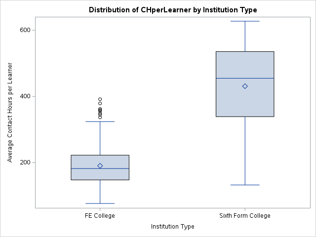
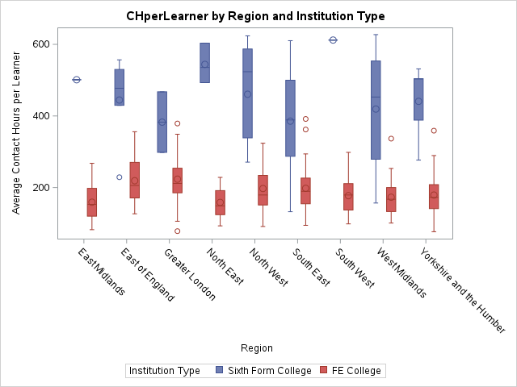
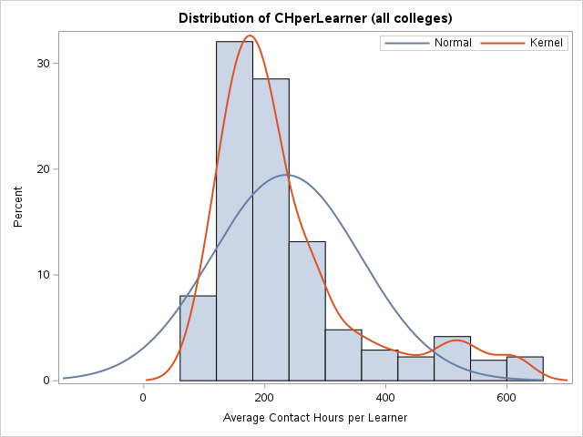
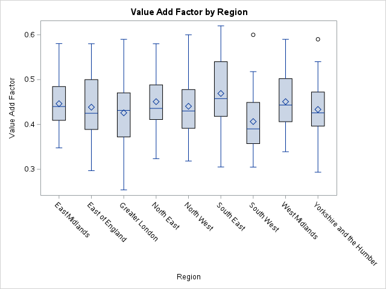
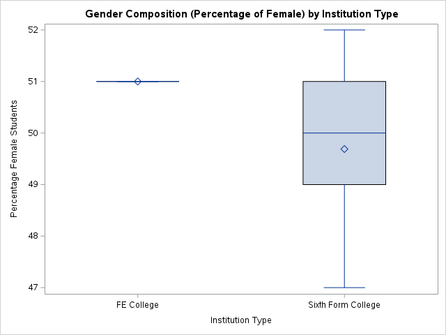

# UK College Contact Learning Hours Analysis

A statistical investigation into contact learning hours (CH) across 354 UK
Further Education (FE) and Sixth Form colleges, examining how institution
type, geographic region, college size, and academic year affect learning
delivery, graduation outcomes, and student value add.

---

## Overview

This project analyses contact learning hours per learner across UK FE and
Sixth Form colleges to answer three core questions:

- Does institution type or geographic region significantly affect how many
  contact hours per learner a college delivers?
- What best predicts graduation pass rates - contact hours, the value add
  factor, or gender composition?
- Have contact hours per learner changed meaningfully across three
  successive academic years?

---

## Data

Three source files covering 354 UK colleges were merged to build the
analysis dataset:

- **6form data** - Contact hours, learner counts, graduation rates, value
  add factors and gender composition for Sixth Form colleges
- **FE data** - Contact hours and learner counts for Further Education
  colleges
- **FE metrics** - Graduation pass rates and value add factors for FE
  colleges, linked by institution ID

The cleaned, merged, analysis-ready dataset (`AllColleges_clean.csv`) is
provided in the `/data` folder. Raw source files are not published.

---

## Methodology

### Data Cleaning & Engineering

- Imported all three files using `INFILE/INPUT` with appropriate
  delimiters (CSV and tab-delimited)
- Removed aggregated sub-total and grand total rows using `INDEX()`
- Flagged missing values per row with a structured `MissingFlag` variable
- Identified and excluded anomalous record ID=79 (CH values ~78 million,
  blank Region confirmed mislabelled grand total row)
- Merged FE data with metrics file using `PROC SORT` + `DATA MERGE` with
  `IN=` flags for match quality control
- Stacked both institution types using `SET`; unified gender variable
  (`GPercentFemale = 100 - GPercentMale` for FE colleges)
- Derived `CHperLearner` per year and averaged across three years with
  zero-division guard
- Classified colleges into five size categories based on CHperLearner
  distribution empirically derived from PROC MEANS (Q1=163, Median=197.7,
  Q3=348.5)
- Applied IQR outlier detection using `CALL SYMPUTX` macro variables;
  outliers routed to a separate dataset - **final clean sample: 311
  colleges**

### Analytical Procedures

| Procedure | Purpose |
|-----------|---------|
| `PROC MEANS` | Descriptive statistics, Q1/Q3 for outlier detection |
| `PROC FREQ` | Frequency tables, quality control checks |
| `PROC TABULATE` | Cross-tabulation of CHperLearner, GradPR, VAF by type and region |
| `PROC CORR` | Pearson correlation matrix (full sample + by institution type) |
| `PROC SGPLOT` | Boxplots, histograms with density overlays, residual plots |
| `PROC SGSCATTER` | Pairwise scatter matrix of key variables |
| `PROC GLM` | One-way and two-way ANOVA with Levene's test and LSD post-hoc |
| `PROC UNIVARIATE` | Residual normality diagnostics (Shapiro-Wilk, Q-Q plots) |
| `PROC REG` | Simple and multiple regression with VIF and Cook's D |

---

## Key Findings

### 1. Sixth Form colleges deliver roughly 2x more contact hours per learner

Sixth Form colleges had a significantly higher mean CHperLearner
(430.86 hours, SD=136.33) compared to FE colleges (190.49 hours,
SD=60.41). This difference held consistently across all nine English
regions.

### 2. Institution type and region both significantly affect contact hours

Two-way ANOVA confirmed a significant main effect of institution type
(F(1,294)=277.96, p<0.0001) and a significant Institution × Region
interaction (F(8,294)=3.29, p=0.0013) regional differences in contact
hours are not uniform across college types.

### 3. VAF is the strongest predictor of both contact hours and graduation outcomes

VAF alone explained 28.24% of variance in CHperLearner (R²=0.2824,
F(1,309)=121.60, p<0.0001). In the reverse regression (GradPR ~
CHperLearner + VAF), VAF was significant (β=0.19, p=0.0007) while
CHperLearner was not (p=0.9412) suggesting the quality of the learning
environment matters more than raw contact hours for graduation outcomes.

### 4. Contact hours changed significantly across three academic years

One-way ANOVA on the reshaped long-format dataset confirmed a significant
year effect (F(2,909)=3.24, p=0.0395).

### 5. Sixth Form colleges also achieve higher graduation pass rates

One-way ANOVA for GradPR by institution type was significant
(F(1,309)=8.38, p=0.0041); Sixth Form colleges averaged 0.8498 vs FE
colleges at 0.8245.

---

## Charts

**CHperLearner by Institution Type**


**CHperLearner by Region and Institution Type**


**Distribution of CHperLearner (all colleges)**


**Value Add Factor by Region**


**Gender Composition by Institution Type**


---

## Repository Structure

```
UK-College-Contact-Hours-Analysis/
├── code/
│   └── contact_learning_hours_analysis.sas   # Full annotated SAS code
├── data/
│   └── AllColleges_clean.csv                 # Analysis-ready dataset
│                                              # (313 rows, 19 variables)
└── outputs/
    ├── CHperLearner_by_Institution_Type__boxplot_.png
    ├── CHperLearner_by_Region_and_Institution__boxplot_.png
    ├── Distribution_of_CHperLearner__histogram_.png
    ├── Value_Add_Factor_by_Region__boxplot_.png
    └── Gender_composition_by_Institution_Type__boxplot_.png
```

---

## Limitations

- **Assumption violations:** Levene's test indicated unequal variances
  across Region groups (p<0.0001); Shapiro-Wilk tests confirmed
  non-normality of ANOVA residuals (W=0.84, p<0.0001). Both are common
  with real-world educational data; the sample size of 311 colleges
  provides robustness to moderate violations.
- **Moderate R²:** The multiple regression model explained 33.79% of
  variance in CHperLearner, suggesting structural and institutional
  factors not captured in this dataset also drive contact hour provision.
- **Raw data not published:** Source files are not included in this
  repository. The cleaned dataset is provided for transparency.

## Future Work

- Extend the analysis to include additional years of data to strengthen
  the year trend finding
- Incorporate deprivation indices or funding data to investigate whether
  resource allocation explains VAF variation by region
- Apply multilevel modelling to account for the nested structure of
  colleges within regions

---

## Tools

- **SAS 9.4** (SAS OnDemand for Academics)
- Procedures: PROC MEANS, PROC FREQ, PROC TABULATE, PROC CORR,
  PROC SGPLOT, PROC SGSCATTER, PROC GLM, PROC UNIVARIATE, PROC REG

---

*Prepared by Sydney Ndabai · MSc Data Analytics ·*
